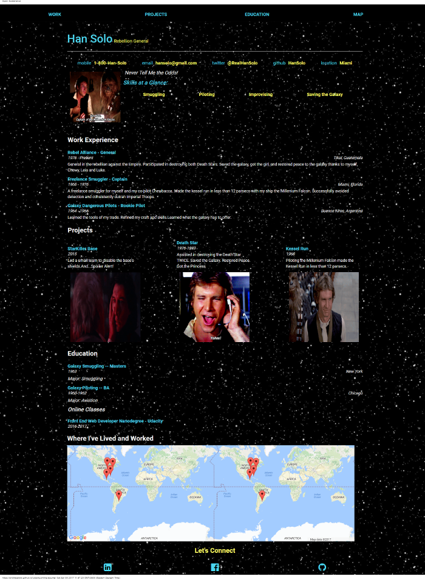

# Interactive Resume

### Overview
Udacity project in the Front-end Web Developer Nanodegree program.The purpose of this project was to practice basic JavaScript & jQuery skills such as loops, functions and DOM manipulation. All of the resume's content is filled in dynamically with jQuery. The style of the resume was customized using Bootstrap and CSS.

- Fork the project repo from [Udacity's Github](https://github.com/udacity/frontend-nanodegree-resume)

- Project was evaluated by a Udacity reviewer according to this [project rubric](https://review.udacity.com/?_ga=1.189245867.12280332.1465333852#!/projects/2962818615/rubric)

## Mockup
This is the provided mockup of the resume project

## Outcome
My version of the project.

### How to get started

Experience the app at https://andrwsalcdo.github.io/udacity-online-resume/

To explore the codebase:
- Clone or download the ZIP link
- Open the index.html file.              
